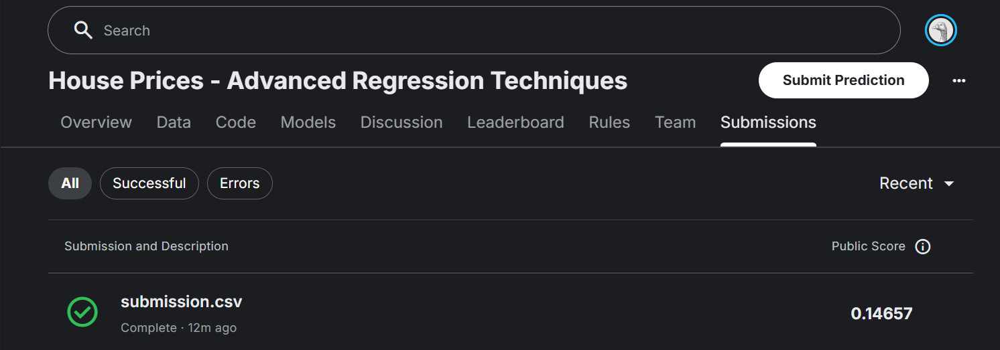

# 🏠 House Price Prediction — Kaggle Competition

An end-to-end machine learning project built for the [Kaggle House Prices: Advanced Regression Techniques](https://www.kaggle.com/competitions/house-prices-advanced-regression-techniques) competition.

**Kaggle Score: 0.14657 RMSLE**



---

## 📁 Project Structure

```
House-Price-Prediction/
├── data/
├── images/
├── models/
├── notebooks/
│   └── house_price_prediction.ipynb
├── requirements.txt
└── README.md
```

---

## 🔧 Workflow

### 1. Exploratory Data Analysis
- Inspected feature types, distributions, and missing value patterns
- Identified numeric, nominal, and ordinal features

### 2. Data Preprocessing (Train)
- **Missing value imputation** — median for numeric, mode for categorical, `'None'` for ordinal quality columns
- **Feature engineering:**
  - `HouseAge` — years since built at time of sale
  - `GarageAge` — years since garage was built
  - `WasRemodeled` — binary flag for remodeled homes
  - `HasGarage` — binary flag for garage presence
- **Ordinal encoding** — quality columns (`ExterQual`, `BsmtQual`, `KitchenQual`, etc.) encoded on a `None → Po → Fa → TA → Gd → Ex` scale
- **One-hot encoding** — nominal columns (`MSZoning`, `Neighborhood`, `SaleType`, etc.)
- **Label encoding** — binary columns (`CentralAir`, `PavedDrive`)
- **Manual mapping** — `BsmtExposure`, `BsmtFinType1`, `BsmtFinType2`
- **Log transformation** — `SalePrice` transformed using `log1p` to reduce skewness

### 3. Modeling
- Model: **Linear Regression**
- Target: `log1p(SalePrice)`
- Train/test split: 80/20
- Evaluation on validation set:
  - **MSE:** 0.0140
  - **R² Score:** 0.9143

### 4. Test Preprocessing & Submission
- Applied the same preprocessing pipeline to `test.csv` using encoders fitted on training data only
- Reversed log transformation with `np.expm1()` before submission
- Final predictions saved to `submission.csv`

---

## 📊 Results

| Metric | Score |
|--------|-------|
| Kaggle RMSLE | **0.14657** |
| Validation R² | **0.9143** |
| Validation MSE | **0.0140** |

---

## 🛠️ Tech Stack

- Python
- Pandas, NumPy, Seaborn
- Scikit-learn
- Jupyter Notebook

---

## 🚀 How to Run

1. Clone the repo:
```bash
git clone https://github.com/SardarAhmed05/House-Price-Prediction.git
```

2. Install dependencies:
```bash
pip install -r requirements.txt
```

3. Open the notebook:
```bash
jupyter notebook notebooks/house_price_prediction.ipynb
```

4. Run all cells top to bottom.

---

## 📌 Notes

- Encoders are fitted **only on training data** and reused on test data to prevent data leakage
- Outlier removal was applied to training data only
- The log transformation on `SalePrice` was critical for model performance


